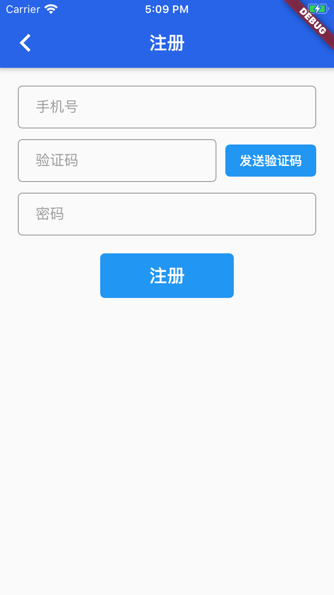

# Widght介绍


Flutter Widget采用现代响应式框架构建，这是从 React 中获得的灵感，中心思想是用widget构建你的UI。 Widget描述了他们的视图在给定其当前配置和状态时应该看起来像什么。当widget的状态发生变化时，widget会重新构建UI，Flutter会对比前后变化的不同， 以确定底层渲染树从一个状态转换到下一个状态所需的最小更改（译者语：类似于React/Vue中虚拟DOM的diff算法）。


Widget主要分为两种:StatelessWidget和StatefulWidget

## StatelessWidget & StatefullWidget

- StatelessWidget
stateless widget 没有内部状态. Icon、 IconButton, 和Text 都是无状态widget, 他们都是 StatelessWidget的子类。

- stateful widget 是动态的. 用户可以和其交互 (例如输入一个表单、 或者移动一个slider滑块),或者可以随时间改变 (也许是数据改变导致的UI更新). Checkbox, Radio, Slider, InkWell, Form, and TextField 都是 stateful widgets, 他们都是 StatefulWidget的子类。


## 常用组件

- Icon  --图标  
    ```dart
    Icon(
                Icons.image,
                size: 50,
        )
    ```
- Text  --文字  
    ```dart
    Text(
                  "你好",
                  style: TextStyle(color: Colors.black, fontSize: 20),
        )
    ```
- Image  --图片  
    ```dart
    Image.network(
            "https://ss3.bdstatic.com/70cFv8Sh_Q1YnxGkpoWK1HF6hhy/it/u=3766638011,1215468410&fm=26&gp=0.jpg",
            width: 80,
            height: 80,
    )
    ```
- FlatButton  --按钮  
    ```dart
    FlatButton(
                  textColor: Colors.white,
                  color: Colors.blue,
                  child: Text("提交"),
                  shape: RoundedRectangleBorder(
                    borderRadius: BorderRadius.all(Radius.circular(10)),
                  ),
                  onPressed: () {},
    )
    ```
- IconButton  --图标按钮  
    ```dart
    IconButton(
      icon: Icon(Icons.arrow_back_ios),
      onPressed: () {
        Navigator.of(context).pop();
      },
    )
    ```
- TextField  --输入框  
    ```dart
    TextField(
      decoration: InputDecoration(
          hintText: _hint,
          contentPadding: EdgeInsets.fromLTRB(20, 10, 20, 10),
          border: OutlineInputBorder(
            borderRadius: BorderRadius.circular(5),
          )),
    )
    ```
- Scaffold  --一个路由页的骨架,使用它可以很容易地拼装出一个完整的页面  
    ```dart
    Scaffold(
      appBar: AppBar(
        title: Text("标题"),
      ),
      body: ...,
    )
    ```
- AppBar  --标题栏  
    ```dart
    AppBar(
    title: Text(title),
    leading: IconButton(
      icon: Icon(Icons.arrow_back_ios),
      onPressed: () {
        Navigator.of(context).pop();
      },
    ),
  )
    ```
- Row  --横向布局  
    ```dart
    Row(
            children: <Widget>[
              Icon(
                Icons.image,
                size: 50,
              ),
              Text(info.name),
              Spacer(),
              Icon(Icons.star),
            ],
        ),
    ```
- Column  --纵向布局  
    ```dart
    Column(
                  children: <Widget>[
                    Icon(
                      Icons.image,
                      size: 50,
                    ),
                    Text("微信")
                  ],
        )
    ```
- Stack  --栈布局(叠加布局)  
    ```dart
    Stack(
      alignment: Alignment.bottomCenter,
      children: <Widget>[
        ...
      ],
    )
    ```
- Container  --一个组合类容器,它是DecoratedBox、ConstrainedBox、Transform、Padding、Align等组件组合的一个多功能容器
    ```dart
    Container(
                margin: EdgeInsets.only(left: 10, right: 10),
                child: ...,
            )
    ```
- Expanded  --扩伸布局
    ```dart
    Expanded(
                child: Column(
                  children: <Widget>[
                    Icon(
                      Icons.image,
                      size: 50,
                    ),
                    Text("QQ")
                  ],
                ),
              )
    ```
- ListView  --列表  
    ```dart
    ListView.builder(
                        shrinkWrap: true,
                        itemCount: 10,
                        physics: NeverScrollableScrollPhysics(),
                        itemBuilder: (context, index) {
                          return Text("Hello flutter");
                        }),
    ```
- GridView  --表格  
    ```dart
    GridView.count(
            shrinkWrap: true,
            physics: NeverScrollableScrollPhysics(),
            padding: const EdgeInsets.all(0.0),
            crossAxisSpacing: 10.0,
            crossAxisCount: 2,
            childAspectRatio: 2,
            children: ...)
    ```
- GestureDetector  --触摸事件  
    ```dart
            GestureDetector(
              onTap: (){
                // 点击事件
              },
              child: Container(
                ...
              ),
            )
    ```


## 使用案例

```dart
/// 注册页面
///
///
class RegisterPage extends StatelessWidget {
  @override
  Widget build(BuildContext context) {
    return Scaffold(
      appBar: getCommonBackAppBar(context, "注册"),
      body: Container(
        padding: const EdgeInsets.fromLTRB(20, 20, 20, 20),
        child: Column(
          children: <Widget>[
            buildCommonInputField("手机号"),
            SizedBox(
              height: 12,
            ),
            Row(
              children: <Widget>[
                Expanded(
                  child: buildCommonInputField("验证码"),
                ),
                SizedBox(
                  width: 10,
                ),
                FlatButton(
                  color: Colors.blue,
                  child: Text(
                    "发送验证码",
                    style: TextStyle(color: Colors.white),
                  ),
                  shape: RoundedRectangleBorder(
                      borderRadius: BorderRadius.all(Radius.circular(5))),
                  onPressed: () {},
                )
              ],
            ),
            SizedBox(
              height: 12,
            ),
            buildCommonInputField("密码"),
            SizedBox(
              height: 20,
            ),
            buildCommonBtn("注册", () {}),
          ],
        ),
      ),
    );
  }
}


/// 构建通用的返回AppBar
///
///
AppBar getCommonBackAppBar(BuildContext context, String title) {
  return AppBar(
    title: Text(title),
    leading: IconButton(
      icon: Icon(Icons.arrow_back_ios),
      onPressed: () {
        Navigator.of(context).pop();
      },
    ),
  );
}

/// 构建通用InputField
///
///
Widget buildCommonInputField(String _hint) {
  return Theme(
    data: ThemeData(primaryColor: Colors.blue, hintColor: Colors.grey),
    child: TextField(
      decoration: InputDecoration(
          hintText: _hint,
          contentPadding: EdgeInsets.fromLTRB(20, 10, 20, 10),
          border: OutlineInputBorder(
            borderRadius: BorderRadius.circular(5),
          )),
    ),
  );
}

/// 构建通用Button
///
///
Widget buildCommonBtn(
  String btnText,
  VoidCallback onpress, {
  double width = 150,
  double height = 50,
}) {
  return SizedBox(
    width: width,
    height: height,
    child: FlatButton(
      color: Colors.blue,
      child: Text(
        btnText,
        textAlign: TextAlign.center,
        style: TextStyle(color: Colors.white, fontSize: 20),
      ),
      shape: RoundedRectangleBorder(
          borderRadius: BorderRadius.all(Radius.circular(5))),
      onPressed: onpress,
    ),
  );
}

```

页面效果: 

