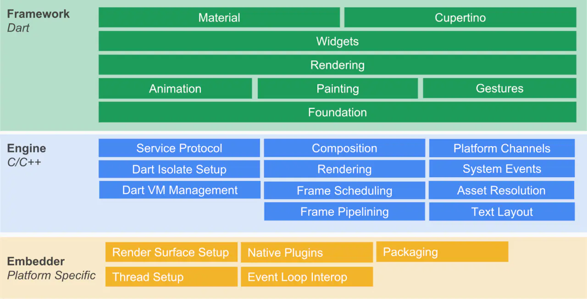
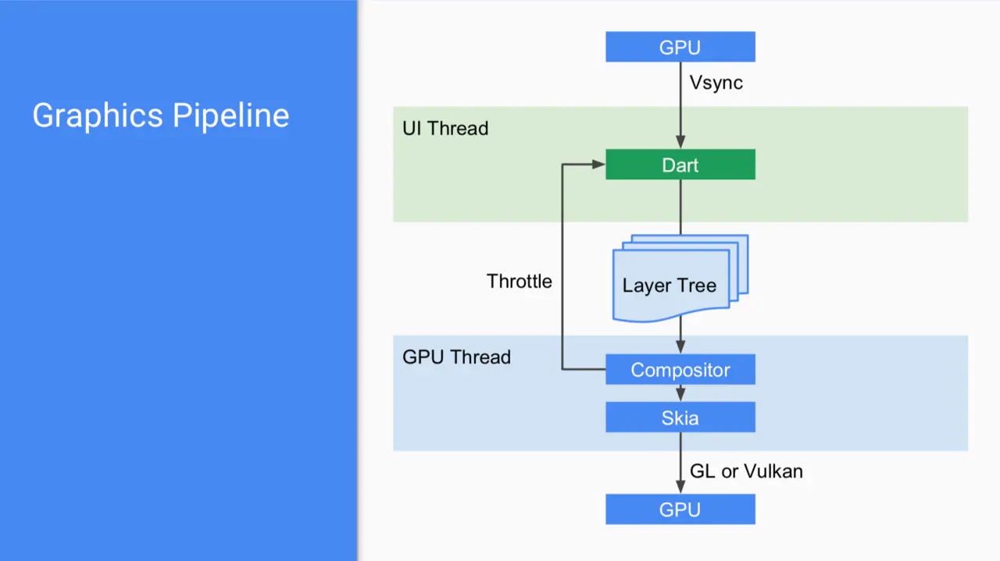

# flutter介绍

## 简介

> Flutter是一个由谷歌开发的开源移动应用软件开发工具包，用于为Android、iOS、 Windows、Mac、Linux、Google Fuchsia开发应用。
Flutter第一个版本支持Android操作系统，开发代号称作“Sky”。 它于2015年4月的Flutter开发者会议上被公布，宣称其目标为实现120FPS的渲染性能。在上海Google Developer Days的主题演讲中，Google宣布了Flutter Release Preview 2，这是Flutter 1.0之前的最后一个重要版本。2018年12月4日，Flutter 1.0在Flutter Live活动中发布，是该框架的第一个“稳定”版本。2019年12月11日，在Flutter Interactive活动上发布了Flutter 1.12，宣布Flutter是第一个为环境计算设计的UI平台。    --维基百科

在Flutter之前已经有好多跨平台UI解决方案，基于WebView的Cordova，基于JavaScript渲染成原生控件的React Native。而Flutter完全颠覆了以往的依赖，使用Skia作为2D渲染引擎，自建UI

### 跨平台方式比较
| 技术类型 | UI渲染方式 | 性能 | 开发效率 | 动态化 | 框架代表 |  
| -- | -- | -- | -- | -- | -- |
| H5+原生 | WebView渲染 | 一般 | 高 | 支持 | Cordova |
| JavaScript+原生 | 原生控件渲染 | 好 | 高 | 支持 | RN |
| 自绘UI+原生 | 调用系统API渲染 | 好 | flutter高,QT低 | 默认不支持 | flutter, QT |

## 架构

- Flutter Framework：纯Dart实现的SDK
    * 由Dart来实现，包含众多安卓Material风格和iOS Cupertino风格的Widgets小部件，还有渲染、动画、绘图和手势等。Framework包含日常开发所需要的大量API，普通应用开发熟悉这些API的使用基本OK了，不过很多特殊场景的控件需要自己根据实际情况进行自定义。

- Engine层：使用C/C++实现的SDK，主要包括Skia、Dart和Text
    * 由C/C++实现，是Flutter的核心引擎，主要包括Skia图形引擎、Dart运行时环境Dart VM、Text文本渲染引擎等。

- Embedder层
    * 主要处理一些平台相关的操作，如渲染Surface设置、本地插件、打包、线程设置等。

## 原理

无论是iOS还是安卓都是提供一个平台的View给Flutter层，页面内容渲染交由Flutter层自身来完成，所以其相对React Native等框架性能更好。Flutter中图形渲染流程：

大致流程如下：

- GPU的Vsync信号同步到UI线程
- UI线程使用Dart来构建抽象的视图结构
- 视图结构在GPU线程中进行图层合成
- 合成后的视图数据提供给Skia图形引擎处理成GPU数据
- 数据再通过OpenGL或Vulkan提供给GPU进行渲染